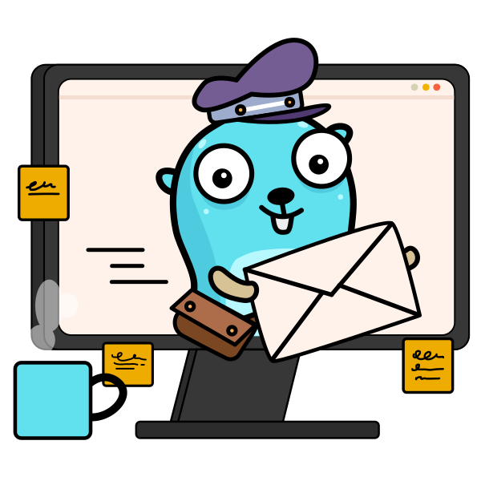

<!--
SPDX-FileCopyrightText: 2022 Winni Neessen <winni@neessen.dev>

SPDX-License-Identifier: CC0-1.0
-->

# go-mail - Simple and easy way to send mails in Go

[](https://pkg.go.dev/github.com/wneessen/go-mail)
[](https://codecov.io/gh/wneessen/go-mail) 
[](https://goreportcard.com/report/github.com/wneessen/go-mail) 
[](https://cirrus-ci.com/github/wneessen/go-mail) 
[](https://github.com/avelino/awesome-go) [](https://discord.gg/zSUeBrsFPB) 
[](https://api.reuse.software/info/github.com/wneessen/go-mail) 
<a href="https://ko-fi.com/D1D24V9IX"></a>

<p align="center"></p>

The main idea of this library was to provide a simple interface to sending mails for
my [JS-Mailer](https://github.com/wneessen/js-mailer) project. It quickly evolved into a full-fledged mail library.

go-mail follows idiomatic Go style and best practice. It's only dependency is the Go Standard Library. It combines a lot
of functionality from the standard library to give easy and convenient access to mail and SMTP related tasks.

Parts of this library (especially some parts of [msgwriter.go](msgwriter.go)) have been forked/ported from the
[go-mail/mail](https://github.com/go-mail/mail) respectively [go-gomail/gomail](https://github.com/go-gomail/gomail)
which both seems to not be maintained anymore.

## Features

Some of the features of this library:

* [X] Only Standard Library dependant
* [X] Modern, idiomatic Go
* [X] Sane and secure defaults
* [X] Explicit SSL/TLS support
* [X] Implicit StartTLS support with different policies
* [X] Makes use of contexts for a better control flow and timeout/cancelation handling
* [X] SMTP Auth support (LOGIN, PLAIN, CRAM-MD)
* [X] RFC5322 compliant mail address validation
* [X] Support for common mail header field generation (Message-ID, Date, Bulk-Precedence, Priority, etc.)
* [X] Reusing the same SMTP connection to send multiple mails
* [X] Support for attachments and inline embeds (from file system, `io.Reader` or `embed.FS`)
* [X] Support for different encodings
* [X] Support sending mails via a local sendmail command
* [X] Support for requestng MDNs (RFC 8098) and DSNs (RFC 1891)
* [X] Message object satisfies `io.WriteTo` and `io.Reader` interfaces
* [X] Support for Go's `html/template` and `text/template` (as message body, alternative part or attachment/emebed)
* [X] Output to file support which allows storing mail messages as e. g. `.eml` files to disk to open them in a MUA

go-mail works like a programatic email client and provides lots of methods and functionalities you would consider
standard in a MUA.

## Support
We have a support and general discussion channel on the Gophers Discord server. Find us at: [#go-mail](https://discord.gg/zSUeBrsFPB)
## Examples

The package is shipped with GoDoc example code for difference scenarios. Check them out on its
[GoDoc page](https://pkg.go.dev/github.com/wneessen/go-mail#pkg-examples)

For ease of use, here is a full usage example:

```go
package main

import (
	"fmt"
	"github.com/wneessen/go-mail"
	"os"
)

func main() {
	// Create a new mail message
	m := mail.NewMsg()

	// To set address header fields like "From", "To", "Cc" or "Bcc" you have different methods
	// at your hands. Some perform input validation, some ignore invalid addresses. Some perform
	// the formating for you.
	// 
	if err := m.FromFormat("Toni Tester", "sender@example.com"); err != nil {
		fmt.Printf("failed to set FROM address: %s\n", err)
		os.Exit(1)
	}
	if err := m.To(`"Max Mastermind <rcpt@example.com>"`); err != nil {
		fmt.Printf("failed to set TO address: %s\n", err)
		os.Exit(1)
	}
	m.CcIgnoreInvalid("cc@example.com", "invalidaddress+example.com")

	// Set a subject line
	m.Subject("This is a great email")

	// And some other common headers...
	//
	// Sets a valid "Date" header field with the current time
	m.SetDate()
	//
	// Generates a valid and unique "Message-ID"
	m.SetMessageID()
	//
	// Sets the "Precedence"-Header to "bulk" to indicate a "bulk mail"
	m.SetBulk()
	//
	// Set a "high" importance to the mail (this sets several Header fields to 
	// satisfy the different common mail clients like Mail.app and Outlook)
	m.SetImportance(mail.ImportanceHigh)

	// Add your mail message to body
	m.SetBodyString(mail.TypeTextPlain, "This is a great message body text.")

	// Attach a file from your local FS
	// We override the attachment name using the WithFileName() Option
	m.AttachFile("/home/ttester/test.txt", mail.WithFileName("attachment.txt"))

	// Next let's create a Client
	// We have lots of With* options at our disposal to stear the Client. It will set sane
	// options by default, though
	//
	// Let's assume we need to perform SMTP AUTH with the sending server, though. Since we
	// use SMTP PLAIN AUTH, let's also make sure to enforce strong TLS
	host := "relay.example.com"
	c, err := mail.NewClient(host,
		mail.WithSMTPAuth(mail.SMTPAuthPlain), mail.WithUsername("ttester"),
		mail.WithPassword("V3rySecUr3!Pw."), mail.WithTLSPolicy(mail.TLSMandatory))
	if err != nil {
		fmt.Printf("failed to create new mail client: %s\n", err)
		os.Exit(1)
	}

	// Now that we have our client, we can connect to the server and send our mail message
	// via the convenient DialAndSend() method. You have the option to Dial() and Send()
	// seperately as well
	if err := c.DialAndSend(m); err != nil {
		fmt.Printf("failed to send mail: %s\n", err)
		os.Exit(1)
	}

	fmt.Println("Mail successfully sent.")
}
```

## Contributors
Thanks to the following people for contributing to the go-mail project:
* [Dhia Gharsallaoui](https://github.com/dhia-gharsallaoui)
* [inliquid](https://github.com/inliquid) 
* [Maria Letta](https://github.com/MariaLetta) (designed the go-mail logo)
