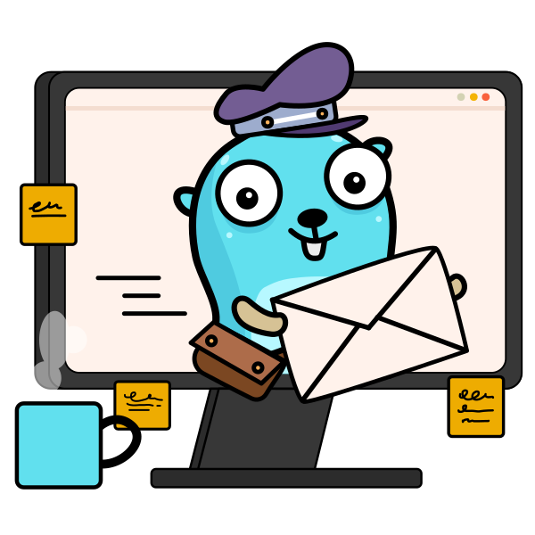

<!--
SPDX-FileCopyrightText: The go-mail Authors

SPDX-License-Identifier: MIT
-->

# go-mail - Easy to use, yet comprehensive library for sending mails with Go

 
 

 

go-mail is a modern, feature-rich library for composing and sending mail with Go.
It offers a simple, idiomatic interface for everyday use while providing the depth
and flexibility needed for advanced email workflows.

Designed around Go best practices, go-mail keeps a small dependency footprint by
building primarily on the Go Standard Library and the official Go extended packages.
It brings together mail composition, encoding, signing and SMTP delivery into a
single, convenient package - giving you the capabilities of a full mail user agent
(MUA), programmatically.

Its feature set is extensive, ranging from a wide selection of SMTP authentication
mechanisms and TLS options to DKIM and S/MIME signing, attachments and inline embeds,
templating, middleware, EML import/export and more (see the full list below).

The `smtp` package of go-mail was originally forked from Go's standard library
`net/smtp` package and has since been extended by the go-mail team to fit the
library's needs - additional SMTP authentication methods, logging, concurrency
safety and more.

## Features

Here are some highlights of go-mail's featureset:

* [X] Very small dependency footprint (mainly Go Stdlib and Go extended packages)
* [X] Modern, idiomatic Go
* [X] Sane and secure defaults
* [X] Implicit SSL/TLS support
* [X] Explicit STARTTLS support with different policies
* [X] Makes use of contexts for a better control flow and timeout/cancelation handling
* [X] SMTP Auth support
  * [X] CRAM-MD5
  * [X] LOGIN
  * [X] PLAIN
  * [X] NTLM
  * [X] SCRAM-SHA-1/SCRAM-SHA-1-PLUS
  * [X] SCRAM-SHA-256/SCRAM-SHA-256-PLUS
  * [X] XOAUTH2
* [X] RFC5322 compliant mail address validation
* [X] Support for common mail header field generation (Message-ID, Date, Bulk-Precedence, Priority, etc.)
* [X] Concurrency-safe reusing the same SMTP connection to send multiple mails
* [X] Support for attachments and inline embeds (from file system, `io.Reader`, `embed.FS` or `fs.FS`)
* [X] Support for different encodings
* [X] Middleware support for 3rd-party libraries to alter mail messages
* [X] Support sending mails via a local sendmail command
* [X] Support for requesting MDNs (RFC 8098) and DSNs (RFC 1891)
* [X] DomainKeys Identified Mail (DKIM) signature support
* [X] Message object satisfies `io.WriterTo` and `io.Reader` interfaces
* [X] Support for Go's `html/template` and `text/template` (as message body, alternative part or attachment/embed)
* [X] Output to file support which allows storing mail messages as e. g. `.eml` files to disk to open them in a MUA
* [X] Debug logging of SMTP traffic
* [X] Custom error types for delivery errors
* [X] Custom dial-context functions for more control over the connection (proxing, DNS hooking, etc.)
* [X] Output a go-mail message as EML file and parse EML file into a go-mail message
* [X] S/MIME message signing support (RSA and ECDSA)
* [X] UNIX domain socket support
* [X] Pluggable SMTP error registry for advanced handling of non-RFC-conforming servers

go-mail works like a programmatic email client and provides lots of methods and functionalities you would consider
standard in a MUA.

## Documentation / Examples

We aim for good GoDoc documentation in our library which gives you a full API reference directly in your
IDE (via your LSP).

We also provide some examples in the [Github Wiki](https://github.com/wneessen/go-mail/wiki) 
(alternative URL: [go-mail.dev](https://go-mail.dev)). For a quick start into go-mail
check out our [Getting started](https://github.com/wneessen/go-mail/wiki/Getting-started) guide.

## Compatibility

Go evolves quickly and introduces valuable improvements with each release. To balance adopting new features with 
ensuring stability for our users, we align our support with the official Go release policy. In practice, go-mail 
will always support the same set of Go versions that the Go team actively maintains.

Since Go provides two releases per year, this translates into roughly one year of guaranteed compatibility for 
any given Go version. We encourage users to stay current with supported Go versions to benefit from security 
updates, performance improvements, and new language features.

## Support

Feel free to start a GitHub discussion or open an issue. You can also join our Discord for support and general chat. 
Find us here: [#go-mail](https://discord.gg/ysQXkaccXk).

## Merch

Thanks to our wonderful friends at [HelloTux](https://www.hellotux.com) we can offer great go-mail merchandising. All merch articles are embroidery 
to provide the best and most long-lasting quality possible.

If you want to support the open source community and represent your favourite Go mail library with some cool drip, check out our merch shop at: 
[https://www.hellotux.com/go-mail](https://www.hellotux.com/go-mail).

## Authors/Contributors

go-mail was initially created and developed by [Winni Neessen](https://github.com/wneessen/), but over time a lot of amazing people 
contributed to the project. Big thanks to all of them for improving the go-mail project (be it by writing- or testing
code, reviewing code changes, suggesting changes/improvements, or writing documentation):

A huge "Thank you!" also goes to [Maria Letta](https://github.com/MariaLetta) for designing our super cool go-mail logo!

## Sponsors

I sincerely thank the amazing go-mail sponsors for their generous support! Your contributions do not go unnoticed and help
keeping up the project!

Just to name some of the amazing people: 

* [kolaente](https://github.com/kolaente)
* [mkalus](https://github.com/mkalus)
* [chriselkins](https://github.com/chriselkins)
* [drakkan](https://github.com/drakkan)
* [jameshueston](https://github.com/jameshueston)
